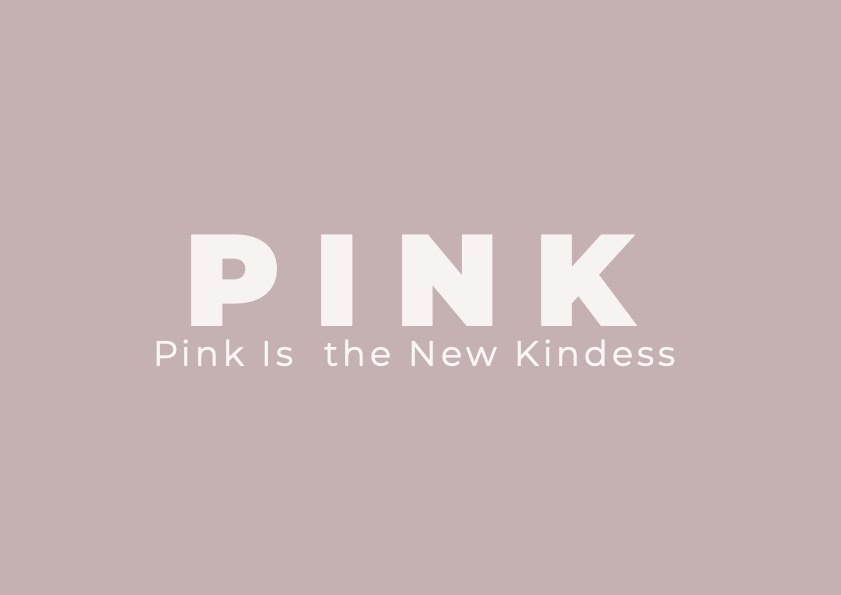

# 🎗️ Pink is a new kindness 🎗️

## Introduction

Welcome to our project called 'PINK is the New Kindness'.

Thanks to the [Code Institute](https://codeinstitute.net/) and [IT Labs](https://www.it-labs.com/), we were honored to take a part in this amazing  Women in Tech Nov'21 #14 collaboration to promote Breast Cancer Awareness. A noble cause we were proud to be part of. 

Also a big thank you to IT Lab representative and team facilitator, [Aleksandra Vinokjikj](https://github.com/alexvinokikj) who watched over the entire project and guided us along the way.

We hope you like this project as much as we enjoyed building it! 

We welcome you to step into our world of Kindness. 

## The Team

PINK team memebers:

* [Estephanie Standen](https://github.com/Esteph27) [HTML, CSS, JavaScript, Python]
* [Sophie Nagle](https://github.com/sophnagle) [HTML, CSS, JavaScript, UX/UI]
* [Dee Cooper](https://github.com/deecooper)
* [Rocky Chan](https://github.com/cloki0610)
* [Kamil Kwiatkowski](https://github.com/kamil-kw) - Team Leder, skilled in [HTML, CSS , JavaScript, Python, Java, Bootstrap]

## Live Site

The live site can be found [HERE](https://kamil-kw.github.io/pink-is-the-new-kindness/#).

## Repository
<!-- [repoLocation](repoLocation) -->

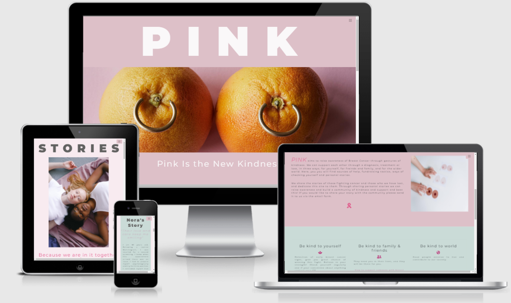

***

## Table of Contents
- [Name of project](#name-of-project)
  - [Live Site](#live-site)
  - [Repository](#repository)
  - [Table of Contents](#table-of-contents)
  - [Objective](#objective)
  - [Brief](#brief)
    - [nameOfSite](#nameofsite)
  - [UX &#8722; User Experience Design](#ux--user-experience-design)
    - [User Requirements](#user-requirements)
    - [Initial Concept](#initial-concept)
      - [Wireframes](#wireframes)
      - [Colour Scheme](#colour-scheme)
      - [Typography](#typography)
      - [Imagery](#imagery)
  - [Features](#features)
    - [Existing Features](#existing-features)
    - [Features Left to Implement](#features-left-to-implement)
  - [Technologies Used](#technologies-used)
  - [Testing](#testing)
  - [Bugs](#bugs)
    - [Current](#current)
    - [Resolved](#resolved)
  - [Development](#development)
  - [Deployment](#deployment)
  - [Credits](#credits)
    - [Content](#content)
    - [Media](#media)
    - [Acknowledgements](#acknowledgements)
    - [Personal Development](#personal-development)

***

## Brief

The goal for this event was to raise Breast Cancer Awareness focusing on the following; providing helpful information and resources to the user relating to Breast Cancer, offer tips and guidance on how to detect signs early, and share personal stories to raise awareness. 

## PINK - Concept

As a name for the team and in keeping with the brief, we chose to create an acronym from the word PINK and came up with; *PINK Is the New Kindness* where Kindness underpins the values and aims of our project:

**P**ink

**I**s the

**N**ew

**K**indness

It's all about kindness towards surrounding members of family and friends, the world around you, and most importantly, yourself. Therefore our motto is "be kind":

* Be kind to **yourself** – detection of early breast cancer signs, give you a great chance of winning this fight. Believe in your strength!
* Be kind to **family & friends** – they need you in their lives, and they will be there for you.
* Be kind to **world** – Good people deserve to live and contribute to our society.

The goal of this website is to provide resources for users on how they can best support themselves, their friends and family, and the wider community, who have been affected by Breast cancer.

It contains a collection of external resources for each of these three parts (individual, friends/family, world) so the user can easily find information depending on their personal needs and circumstances. 

There are also real-life user stories shared from the community and a form that allows a user to submit and share their own personal experiences with Breast Cancer. 

***

[Back to Table Of Content](#tableOfContents)
## Wireframes

These are the initial wireframes from our initial project mind-map and scoping:

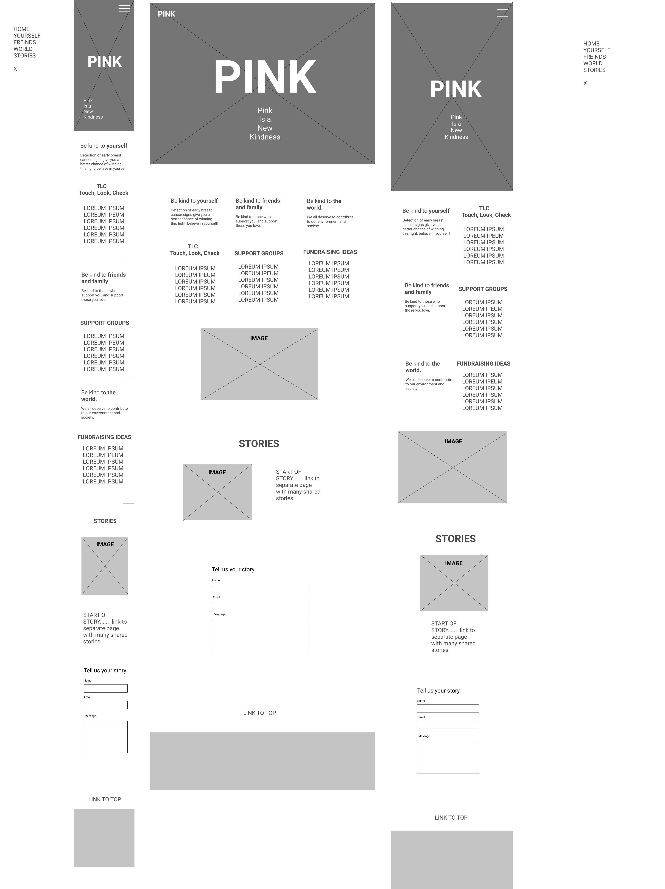

Initial ideas for mobile phone layout:

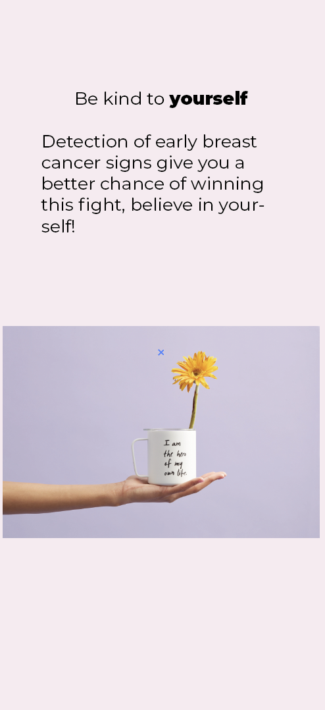
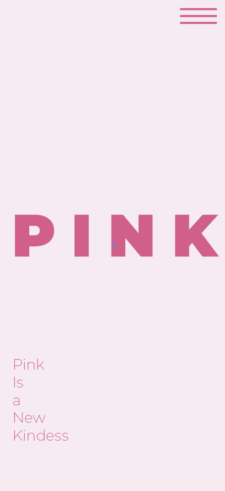
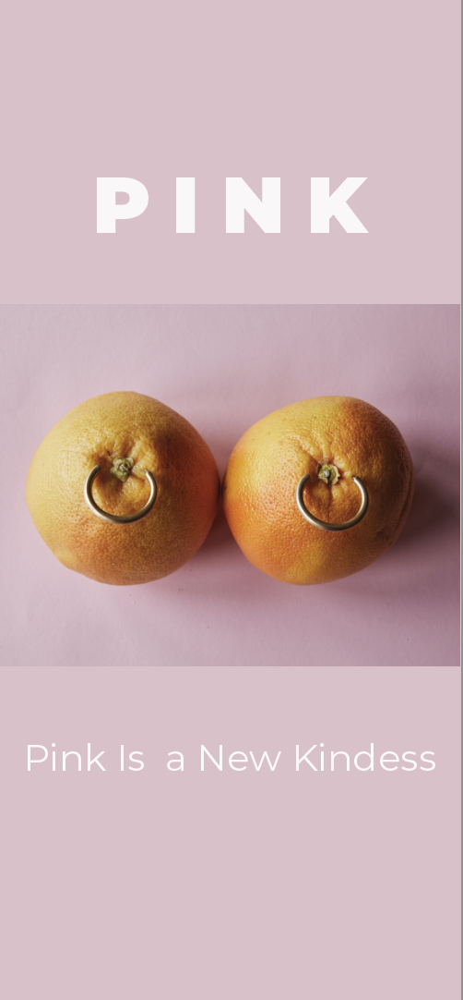 

*** 
[Back to Table Of Content](#tableOfContents)
## UX Design

Breast cancer, or any type of cancer, can be daunting and sometimes devastating. With this in mind, PINK needed to be a place that was warm, happy and inviting. A space where users feel welcomed but also catches their attention. Additionally, as kindness underpins the values for this project, we wanted to ensure this was reflected in our UX. We’ve achieved this through our selective use of colours, light-hearted imagery, icons and fonts. 

The overall aesthetic is clean, modern and “light”. Where often finding information online about breast cancer can be overwhelming, we wanted PINK to be clean and clear for the user. A place where information isn’t in your face, but gently handed to you.

### Colour Palette:

The prominent colour is pink, as pink is not only the name of the project, but also the symbol for breast cancer awareness and it was important to respect this association. Along with the colour pink, we created a custom colour palette which not only compliments the imagery throughout the website, but connotes the feeling of kindness, happiness and hope. 

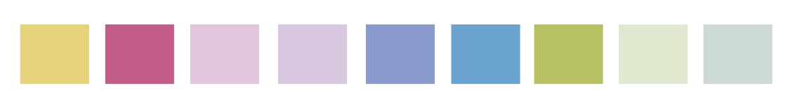

### Fonts:

To keep within the theme and overall aesthetic, we decided for the below fonts which are used throughout the site: 

* Monsterrat Bold - header and subtitles

* Monsterrat regular - copy text 

### Imagery:

We have used light-hearted and tongue-and-cheek imagery throughout the site as we wanted to steer clear from any feeling of being too clinical or “serious”. Breast cancer can be a heavy topic for the user, by implementing these light-hearted images we hope to create a bit of fun for the user and lift a little bit of that weight and worry.

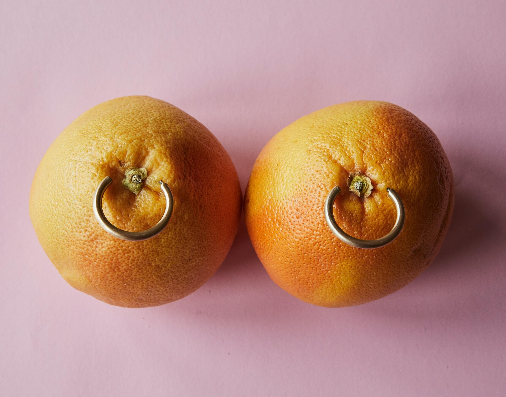

*** 

### User Requirements

PINK is a platform for everyone. From the person who has Breast cancer, to the person who has a loved one with Breast cancer, to the normal person who just wants to support and raise awareness. With this in mind there are 3 main users, here are some user stories:

* I want to educate myself and understand how and what I should check for when looking out for potential signs of Breast Cancer
* I want to learn how I can support friends and family that are going through a bereavement
* I want to find out how I can help someone going through a diagnosis or treatment
* I want to learn how I can support myself through a bereavement
* I want to learn how I can support myself through Breast cancer diagnosis 
* I want to find out how I can help the wider research of cancer treatments and preventative action
* I want to find ideas on how I can raise money for cancer charities
* I want to read stories of those with similar experiences
* I want to share my own expereinces with the community 

***

## Features

### Existing Features

### Landing page:
Being the first page the user lands on, we wanted the landing page to be welcoming as well as visually impactful to the user. We achieved this through keeping it simple yet effective with the use of our tongue-and-cheek hero image, fonts and hover-over features:

The name of the project is placed centrally on the screen in large and bold letters to shout our name out load and proud. In the center across the screen is a our hero image which sets the light-hearted tone we want to acheieve. The slogan below the hero image also tells the user what the project name stands for as well as user readbility and comprehension. 

The hover over features changes the font and slogan colours to pink when the user hovers of them. This feature was added to create an element of fun for the user experierence.

### Introdution section:
This section explains to the user what our platform is about. It outlines what they can expect to find, what they can do and provides an overall introduction to PINK. We placed it right under the hero image section so that the user knows straight away what they're looking into to improve their exeprience. An image is used to break up the page on larger screens and to add difference on a scroll on smaller screens. The image is in keeping with our light-hearted, welcoming and friendly aesthetic. We have also inclded a pink ribbon icon as this is the representation of breast cancer charities and have made the platform name bold and in pink.

### Stories page:
This page aims to provide further community support and raise awareness by sharing with the user real-life stories from the community. The user is also invited to share their personal experience with Breast cancer by using the from at the bottom of the page.

We have also included hover over features on the page title and H3 header to tie in with the features on the home page for cohesiveness. 

Below the form we have included a caoursell with heart warming images and quotes to provide further comfort to the user as well as complimenting the aesthetic of the page.

### Nav bar:
Our Nav bar was built based on Bootstrap frameworks with additional amendments to edit the top of original code to remove long top bar and change color of this tab to pink so will complement to the overall design of the page, in the latest stage hover added to improve UX and interactivity of this feature.

one long bar from left to right, that has been removed and the hambuger bars have been left

Navbar includes two links Home and Stories both will show highlights once active.

### Kindness section:
This section gives users information about the three themes of kindness that we have based our website on. Be kind to yourself, friends, family and the world.
Be kind to yourself and check yourself on a regular basis. Be kind to friends and family as they are also going through this with you. We understand that friends and families of those who have been diganosed with breast cancer often find it diffcult. We provided a link to Breast Cancer Now which gives people information about how to support someone with breast cancer. Be kind to the world. We are aware that having breast cancer can have a negative impact on everything in your life. There are ways to help your quality of life. We provided a link to Susan G Komen about how people with breast cancer can improve their quality of life. Good people deserve to live and contribute to our society.

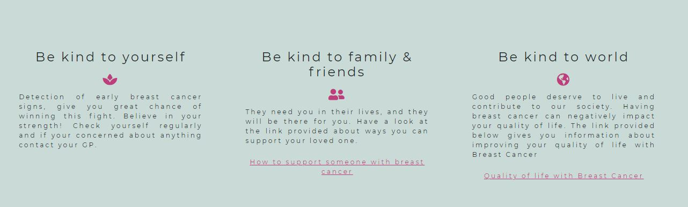

### Information section:

This section includes fundrasing ideas, how to touch look, check and support groups. 
We provided a few links to charties for users who want to donate to breast cancer awarness and research. We also provided a link to Nora Carrolls Shave to Raise Fundraiser. Nora Carroll kindly provided us with her breast cancer story which is featured on our stories page. TLC (touch, look and check) many women/men are unaware about how to properly look out for the signs of breast cancer. We want to inform women/men about what they should be looking for and how to check properly. We provided links to breast cancer now and how to check your breast. These websites provide the correct information about how to check your breasts. There are plenty of support groups and services available for women/men who have been diganosed with breast cancer. We have provided links to some support groups and services.

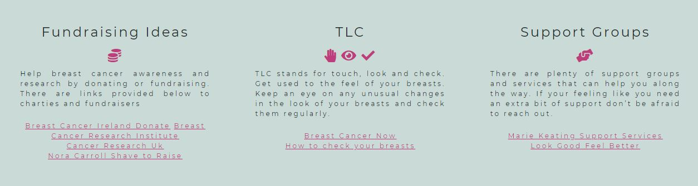

### Carousel:

We have two carousel in our website. These components provdied by Bootstrap framework and it is a slideshow for cycling through a series of content, built with CSS 3D transforms and a bit of JavaScript. It works with a series of images, text, or custom markup. It also includes the previous/next controls and indicators. User can use the controls and indicators to view three images in the indicators.

### Story contact form:
User allowed to use our form to contact us and share their experience. They have to fill the name, email and some text on the input elements and press the submit button to submit the form. And the contents they sent will store in our google sheet file. If the input is empty or the email seems invalid, a alert message will show up with warning messages.

### Footer:
Our footer includes the back to top button and our social media links(Facebook and Twitter). Our social media links allow users to have a means of contact if they wish to get in touch with the PINK team. We added in the text created with kindess by Team pink to let users know who created this website.

### Animations:

WE have made a scale animation using CSS and JS so that on hover elements with the class of 'scale' enlarge by 20%. This is used on the main page on our values section and also changes background colour. 

On the stories page, we have created animations so that when a user hovers over 'We are in this together' it scales up, changes colour to pink and permanently stays this way. This is done using javascript to add a class with these permanent styles.

        $(document).ready(function () {
            $(".subHeader").one("mouseover", function() {
            $(".subHeader").addClass("permahover");
        });
        });

Finally, we have added a pulse and change colour effect on the Share your story form using CSS keyframes. These animations help in keeping the user engaged and want to contribute.

The chosen effects tie in with the brand aestetic we were looking for; accessible, light-hearted and contemporary.

### Fade on scoll:
We have created a JavaScript function so elements that are given a class of 'fade' are faded into the window. The speed can be changed in the function. This gives a nice smooth, soft effect on bringing the elements into the screen. It gives a smooth user experience.

### Scroll back to top:
We have added a link at the bottom of the pages so the user can quickly go back to top for enhanced user experience. This is a small addition but can greatly improve the experience and help the user navigate the site.

### Fav icon:
Favicon pink ribbon download from free catalog [FreeFavicon](https://www.freefavicon.com/), added to provide to improve UX and stand out in the browser tab

*** 

### Features Left to Implement

The next development step in PINK project would be creating a fundraising page, where users can choose a cause they would like to support and contribute to it using one of the suggested payment methods.

## Technologies Used

[Back to Table Of Content](#tableOfContents)

## Testing

* Responsive tools - Used google dev tool to test responsiveness.

* Lighthouse - Used as a tool for improving the quality of web pages.

* Am I responsive design - Am I responsive design used to test end product responsiveness.

### Form validation:
We test the form validation in three situation:

* When the input is valid - If the input is valid, the google sheet file should have a new record.

* When one or more input is empty - If one or more input is empty, a alert will pop up and the data will not send.

* When email seems invalid - If the email seems invalid, another alert will pop up and the data will not be send.

## Bugs

### Resolved Bugs:

1.	Scale JavaScript/CSS

We have made a scale transition so that on hover, any element with the class 'scale' enlarges by 20% and changes background color. On testing on a separate branch, it worked but after merging with the main branch it stopped. Testing in the console showed the correct element was picked up and reviewing the code showed it was logical. Post merge we found it worked – there may have been a delay in it going through to the live site! 

2.	Fade JavaScript 

We have added a fade in on scroll. The initial code was built so that an object faded in when the whole element was in the window as per the below code:

    $(document).ready(function () {
        /* Every time the window is scrolled ... */
        $(window).scroll(function () {
            /* Check the location of each desired element */
            $(".fade").each( function() {
                
                let bottom_of_object = $(this).offset().top + $(this).outerHeight();
                let bottom_of_window = $(window).scrollTop() + $(window).height();

                /* If the object is completely visible in the window, fade it it */
                if( bottom_of_window > bottom_of_object ){
                    
                    $(this).animate({'opacity':'1'}, 1000);
                }
            }); 
        });
    }); 

However on testing we thorught that this looked like it was loading the page too slowly and it did not give the effect we wanted. We changed this so that it fades in on enter and at a faster screen. We have gone with this code and taken out the need for the whole element to be above the bottom of the screen: 

    $(document).ready(function () {
        /* Every time the window is scrolled ... */
        $(window).scroll(function () {
            // Check the location of each desired element with a fade class */
            $(".fade").each( function() {
                // fade in
                $(this).animate({'opacity':'1'}, 2000);
            }); 
        });
    });

3.	Back to Top Link 

This was a typo in that the element from font-awesome wasn’t copied correctly. 

It was corrected from:

    

        <a href="#" class="fas fa-chevron-up">
          Back to Top
        </a>
    

To:

    

      <a href="#"><i class="fas fa-chevron-up"></i>
        Back to Top
      </a>
    

4. Intro Section and colour change on headers

When adding the introduction paragraph and image, we found that it conflicted with the landing page and pushed the h3 sub-heading out when on a desktop screen. 

To counter this, we added padding to the top and edited the background-colour to match the landing page so that the transition is smooth and unnoticed as below. 

    .intro {
        padding: 100px 40px;
        font-size: 1.2rem;
        background-color: #DDC0C8;
      }

5. Lighthouse test: 
### Web page performance:
Due to large size of the image the loading of the page site was in total of 10s the original score of 69, size of images reduced by 50% to speed up loading. Score increaded to 87 for moblie and 100 for desktop.

### Accessibility: 
Accesibility score of 66 caoused by low amount of alt atributes, after fix score increased to:
* Index 98 for both moblie and desktop

### Best Practices:
Best Practice orginal score of 87 caused by missing detatils in meta tag and links to cross-origin destinations wich appear unsafe fixed by implementing rel noopener
* Index page score incresed increase to 100 for moblie and 98 desktop

### SEO:
Original score 83 increase after all implementations to:
* Index & stories: 92 for mobile and 90 for desktop

## Unfixed Bugs
We note that there is a small overflow on the righthand side on the main page on the landing section and the subheader. 

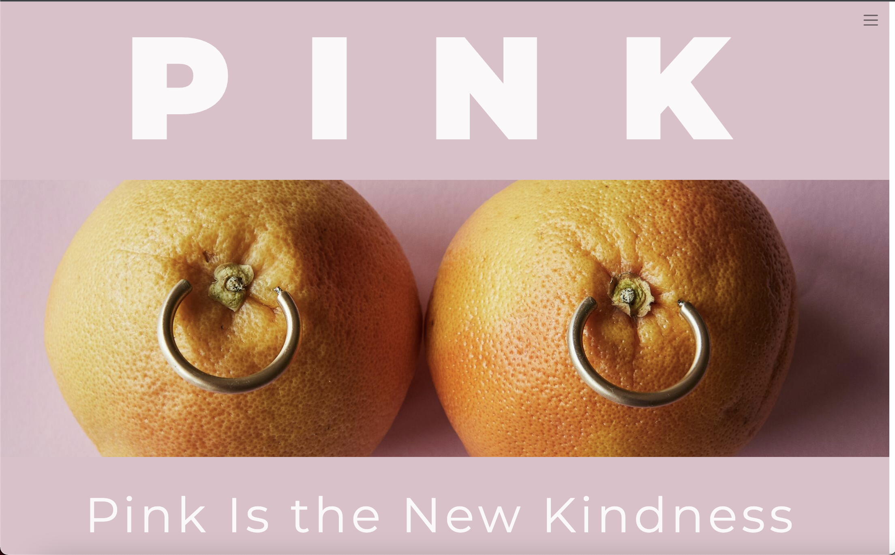

On testing we think this code is a bootstrap/div bug. It needs further exploration to fix. 

*** 

## Deployment

### Github Pages:

We used GitHub pages to deploy my final project. To do this we had to:

1. Create a repository on GitHub.

2. Clone the repository on your chosen source code editor (Atom in my case) using the clone link.

3. Add files to Git (staging area) and use the atom commit to master button.

4. Use git within atom to push the code.

5. Go to GitHub and load your repository.

6. Select settings.

7. Select pages on the left menu bar.

8. Click on the master branch.

9. This will now generate a link with your website live.

### Forking the GitHub repository:

By forking out of this repository you will be able to view and edit the code without affecting the original repository.

1. Locate the GitHub repository. Link to repo: https://github.com/kamil-kw/pink-is-the-new-kindness

2. Click the button in the top right-hand corner "Fork"

3. This will take you to your own repository to a fork that is called the same as the original branch.

### Making a local clone:

1. Locate the GitHub repository. Link as above.

2. Next to the green Gitpod button you will see a button "code" with an arrow pointing down

3. You are given the option to open with GitHub desktop or download zip

4. You can also copy https full link, go to git bash and write git clone and paste the full link

*** 

## Technologies used:

1. HTML
- Markup language providing content and structure of website.

2. CSS
- Styling language providing website styles and appearance.

3. Javascript
- User interactivity 

## Validation:

* W3C HTML validator - Tested by W3C validators to ensure correct practices used in html code.

* W3C CSS validator - Tested by W3C validators to ensure correct practices used in css code.

* JShint validator - Tested by W3C validators nto ensure correct practices used in JavaScript code.

*** 

## Credits

* [Pexels](https://www.pexels.com/) and [Unsplash](https://unsplash.com/) for providing free images for our site

* [FreeFavicon](https://www.freefavicon.com/) for providing free favicon pink ribon

* [Google Fonts](https://fonts.google.com/) for fonts

## Acknowledgements
A special thanks to:

* Code Institue for hosting the event

* IT Labs for hosting the event 

* [Aleksandra Vinokjikj](https://github.com/alexvinokikj) for being the team facilitator 

